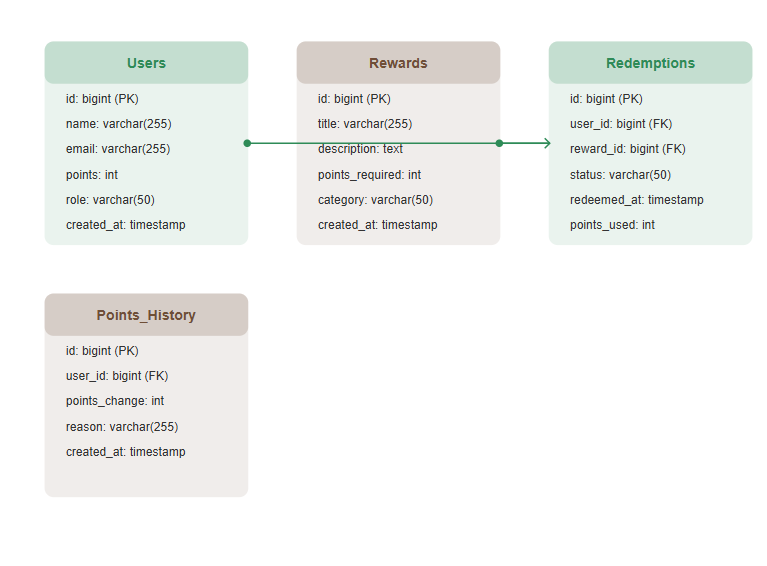
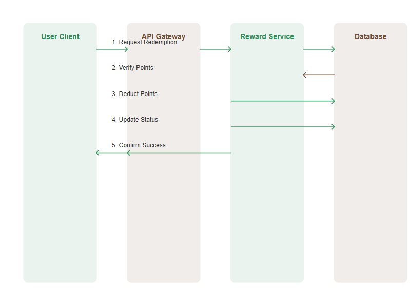

# CoffeShopRewards

---

### Explanation of the README Sections:
1. **Installation Steps**:
   - **Clone**: First, clone the repository to your local machine.
   - **Install dependencies**: Use `npm install` to install all dependencies from `package.json`.
   - **Start the project**: Use `npm run dev` to start the Vite development server.

### Class diagram

### Use case Diagram

